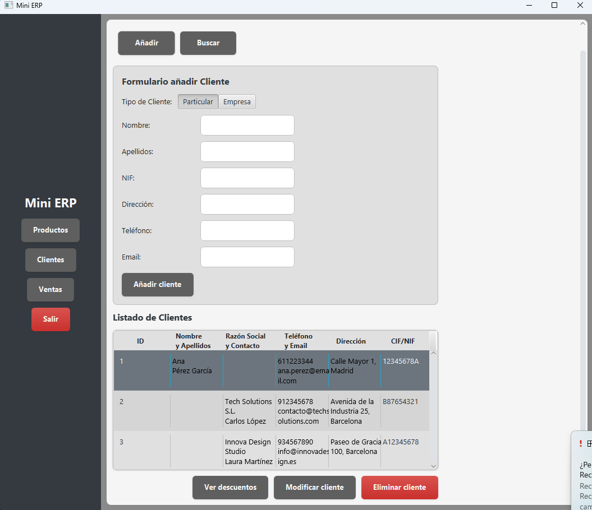
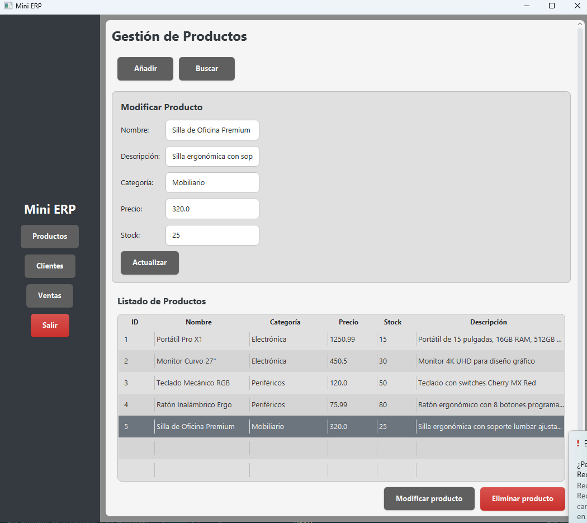
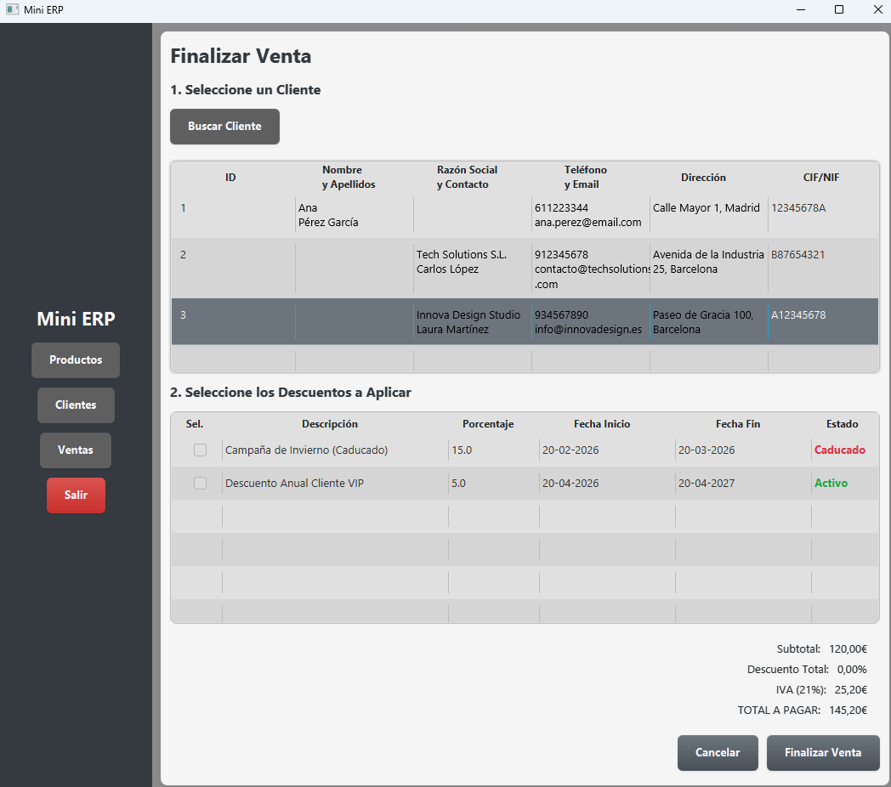

# Mini-ERP: Sistema de Gestión JavaFX (Proyecto Autodidacta)


## 🌟 Resumen del Proyecto

**Mini-ERP** es una aplicación de escritorio robusta orientada a la gestión empresarial, desarrollada de forma **100% autónoma y autodidacta** durante las vacaciones de verano entre 1º y 2º de DAM (Desarrollo de Aplicaciones Multiplataforma).

El objetivo principal fue dominar los pilares de la ingeniería de software —**Arquitectura, Integridad de Datos y Patrones de Diseño**— implementándolos manualmente y sin la abstracción de frameworks de alto nivel, demostrando así un dominio sólido de los fundamentos de Java.

---

## 🏗️ Análisis Académico y Arquitectura

### Patrón MVC + DAO
El proyecto sigue una arquitectura estricta de separación de responsabilidades:
- **Vista**: Estructura definida en ficheros FXML modulares.
- **Controlador**: Gestión de eventos e interacción con la lógica de negocio.
- **DAO (Data Access Object)**: Capa de persistencia aislada que encapsula toda la comunicación con SQLite. Esto permite que el resto de la app sea agnóstica a la base de datos utilizada.

### Integridad Transaccional (JDBC Manual)
Una de las mayores fortalezas técnicas es el manejo manual de **transacciones JDBC**. En operaciones críticas como la creación de una venta (que involucra múltiples tablas como `ventas`, `detalles_venta` y `venta_descuentos`), se utiliza una lógica atómica:
1. **Desactivación de Auto-commit**: `conn.setAutoCommit(false)`.
2. **Ejecución Atómica**: Si un paso falla, se ejecuta un `rollback()`.
3. **Persistencia**: Solo si todos los pasos tienen éxito se realiza el `commit()`.

### Modularidad de UI (FXML Inclusion)
En lugar de archivos FXML masivos, he utilizado un patrón de **inclusión de componentes**. Cada pieza de la interfaz (como la tabla de productos o el formulario de búsqueda) es un componente independiente con su propio controlador, fomentando la reutilización de código (DRY).

---

## 🚀 Funcionalidades Principales

- **Gestión de Inventario**: CRUD completo de productos con filtrado en tiempo real.
- **Módulo de Ventas**: Lógica de negocio completa con aplicación de descuentos y gestión de "carrito".
- **Generación de Facturas**: Integración con **iText7** para crear facturas PDF profesionales de forma dinámica.
- **Validaciones Avanzadas**: Sistema de validación manual para NIF/CIF, emails y teléfonos.

---

## 📸 Galería de la Aplicación
| Panel de Clientes | Gestión de Inventario |
|:---:|:---:|
|  |  |
| *Organización general y gestión de contactos* | *Filtrado y control de stock real* |

| Proceso de Venta |
|:---:|
|  |
| *Lógica de transacciones, descuentos y totales* |

---

## 🛠️ Stack Tecnológico

- **Lenguaje**: Java 17 / 21
- **Interfaz**: JavaFX 21
- **Base de Datos**: SQLite (JDBC)
- **Generación PDF**: iText7
- **Gestión de Proyecto**: Maven
- **Pruebas**: JUnit 5 y Mockito

---

## ⚙️ Instalación y Ejecución

### Requisitos
- JDK 17 o superior.
- Maven (incluido binario portable en el repo).

### Pasos
1. Clona el repositorio.
2. Compila el proyecto:
   ```bash
   mvn clean compile
   ```
3. Ejecuta la aplicación:
   ```bash
   mvn javafx:run
   ```

---

## 👨‍💻 Sobre el Proyecto
Desarrollado por **Noé (ncondeviladev)** como muestra de proactividad, aprendizaje autodidacta y pasión por el desarrollo de software bien estructurado.
